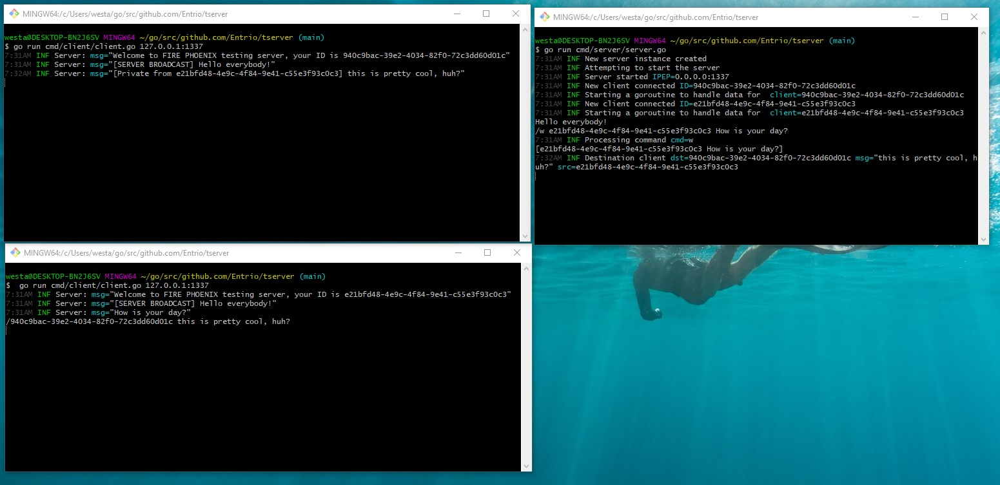

# tserver
### Test task for a recruiter

_Please note, some code was taken from my MUD server located [here](https://github.com/Entrio/aeonofstrife/tree/master/game)_

This by all means is not a production ready, or an optimized system. It is simply to demonstrate some of my skills and knowledge. For a more production ready projects that are currently in use, please refer to my [github repository](https://github.com/Entrio/aeonofstrife) 

This project uses go modules.

The program consists of two components: **_client_** and **_server_**.

### Server
To launch the server, type `go run cmd/server/server.go`. By default, the server listens on `0.0.0.0:1337`

To send a message to all users, just type the message in the console and hit enter, to send a message to a user, type `/w <CLIENT UUID> <msg>`

### Client
To launch a client, execute `go run cmd/server/client.go 127.0.0.1:1337`

To send a message to the server, just type text in the console and hit enter, to send a message to a specific client, type `/<CLIENTUUID> <msg>`

### Tests
Unfortunately I ran out of time to complete the tests for this program